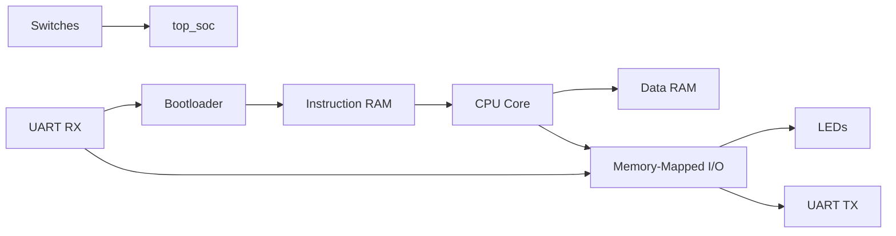

# FACC

FACC, short for **FPGA-Based Assembly Computer**, is a compact soft computer written in Verilog. It explores how far a very small custom CPU can go with a clean 8-bit datapath, a 16-bit instruction format, memory-mapped I/O, and a UART-based programming path.

This repository currently focuses on the **hardware side** of the project: the CPU, memory system, UART peripherals, and two SoC integration attempts. The architecture is intentionally small enough to understand in one sitting, yet complete enough to run simple assembly-style programs such as an echo loop.

## Why This Project Exists

FACC is built as a learning-oriented computer system:

- A tiny custom ISA is easier to study than a full commercial architecture.
- The RTL is short enough to inspect without losing the system-level view.
- The second design iteration removes the need to re-synthesize the FPGA for every program change.
- UART, switches, and LEDs provide a practical bridge between assembly code and real hardware behavior.

## Repository Layout

| Path | Role |
| --- | --- |
| `attempt_1_complile_all_the_time/` | First complete SoC attempt. Programs are hard-coded into ROM, so changing software means regenerating the FPGA image. |
| `attempt_2_compile_free/` | Recommended version. Adds a UART bootloader and writable instruction RAM so programs can be loaded without recompiling the FPGA design. |
| `LICENSE` | MIT license. |

If you only want to study or extend one version, start with **`attempt_2_compile_free`**.

## Architecture Overview



At the center of the system is a tiny Harvard-style CPU:

- **8-bit data path**
- **16-bit instructions**
- **4 general-purpose registers**: `R0` to `R3`
- **8-bit program counter**
- **Zero flag** for conditional branching
- Separate instruction and data memories
- Memory-mapped I/O for LEDs, switches, and UART status/data

## CPU Summary

| Item | Description |
| --- | --- |
| Data width | 8-bit |
| Instruction width | 16-bit |
| Registers | 4 x 8-bit |
| Flag | `Z` (zero) |
| Program flow | Sequential execution with `JMP` and `JZ` |
| Data memory access | `LOAD` / `STOR` |
| Peripheral access | `IN` / `OUT` |

Instruction fields are decoded as follows:

```text
15          12 11   10 9    8 7                0
+-------------+-------+------+------------------+
|   opcode    |  Rd   |  Rs  |   imm / addr     |
+-------------+-------+------+------------------+
```

The low byte is reused as an immediate value, memory address, jump target, or I/O port number depending on the opcode.

## Instruction Set

| Opcode | Mnemonic | Meaning |
| --- | --- | --- |
| `0001` | `LDI Rd, imm` | Load an 8-bit immediate into `Rd`. |
| `0010` | `LOAD Rd, addr` | Read a byte from RAM into `Rd`. |
| `0011` | `STOR Rd, addr` | Write `Rd` to RAM. |
| `0100` | `MOV Rd, Rs` | Copy `Rs` into `Rd`. |
| `0101` | `ADD Rd, Rs` | Add `Rs` to `Rd`, update zero flag. |
| `0110` | `SUB Rd, Rs` | Subtract `Rs` from `Rd`, update zero flag. |
| `0111` | `AND Rd, Rs` | Bitwise AND, update zero flag. |
| `1000` | `JMP addr` | Unconditional jump. |
| `1001` | `JZ addr` | Jump if zero flag is set. |
| `1010` | `IN Rd, port` | Read from an I/O port into `Rd`. |
| `1011` | `OUT Rd, port` | Write `Rd` to an I/O port. |
| other / `0000` | `NOP`-like | No operation in the current implementation. |

## I/O Map

The SoC uses simple memory-mapped I/O ports.

| Port | Direction | Description |
| --- | --- | --- |
| `0x00` | Write | Drive the 8-bit LED output register. |
| `0x01` | Write | Send one byte through UART TX. |
| `0x02` | Read | UART TX busy flag. |
| `0x03` | Read | Current 4-bit switch state in the low nibble. |
| `0x04` | Read | Last received UART byte. |
| `0x05` | Read | RX ready flag. |
| `0x05` | Write | Clear the RX ready flag. |

This makes the platform easy to drive from assembly: LEDs become a direct output peripheral, while UART status and data registers enable simple polled serial programs.

## The Two Design Attempts

### Attempt 1: ROM-Based Software

The first implementation stores firmware directly in a Verilog ROM. It is straightforward and great for first bring-up, but every software change requires a full FPGA rebuild.

What it is good for:

- Understanding the CPU and SoC wiring
- Validating the ISA with a fixed demo program
- Minimal hardware complexity

What it is not good for:

- Fast software iteration
- Interactive experimentation

The built-in ROM example is an **echo program**: it waits for a UART byte, reads it, waits for the transmitter to become idle, and sends the same byte back.

### Attempt 2: Compile-Free Program Loading

The second implementation adds a small bootloader and instruction RAM. In boot mode, the CPU is held in reset while UART bytes are packed into 16-bit instructions and written into IRAM. After loading, you release boot mode and the CPU begins executing from address `0x00`.

This is the more practical version because software iteration no longer depends on FPGA synthesis.

## UART Programming Flow

`attempt_2_compile_free` is built around a very simple serial loading protocol:

1. Set `sw[3] = 1` to enter download mode.
2. The bootloader holds the CPU in reset.
3. Send program words over UART as **two bytes per instruction**, high byte first and low byte second.
4. Each completed 16-bit word is written into instruction RAM and the IRAM write address increments automatically.
5. Clear `sw[3]` to let the CPU start executing from instruction address `0x00`.

Example encoding:

```text
LDI R0, 0x41

opcode = 0001
Rd     = 00
Rs     = 00
imm    = 01000001

binary word = 0001_00_00_01000001
hex word    = 0x1041
UART bytes  = 0x10 0x41
```

## Clocking and UART Assumption

The UART modules use `BAUD_DIV = 1250`. With a **12 MHz** system clock, that corresponds to **9600 baud**. If your FPGA board uses a different clock, adjust the divider accordingly.

The source also contains pin comments in the top-level SoC for one specific board wiring example, but this repository does **not** currently include a constraint file. You will need to provide your own pin assignments in your FPGA toolchain.

## Getting Started

Because the repository contains raw RTL rather than a vendor-specific project, the setup flow is intentionally generic:

1. Create a new FPGA project in your preferred toolchain.
2. Choose either `attempt_1_complile_all_the_time` or `attempt_2_compile_free`.
3. Add all Verilog files from that directory.
4. Set `top_soc` as the top module.
5. Add constraints for your board's clock, reset, switches, LEDs, and UART pins.
6. Build and program the FPGA.
7. For `attempt_2_compile_free`, use `sw[3]` to enter boot mode and load instructions over UART.

Recommended path:

- Use **Attempt 1** if you want the shortest route to a fixed demonstration.
- Use **Attempt 2** if you want a real development loop for software on the custom CPU.

## Current Scope and Missing Pieces

The current repository is best described as a **hardware-first prototype**. A few pieces are implied by the project name, but are not yet included here:

- No assembler implementation is currently checked in.
- No UART host-side uploader script is included.
- No simulation testbench is included.
- No FPGA constraint file or board project is included.

That said, the ISA, bootloader behavior, and I/O map are all simple enough that adding an assembler or uploader is a natural next step.

## Why FACC Is Interesting

FACC sits in a useful middle ground between a toy CPU and a full computer project. It is small enough to learn from quickly, but complete enough to demonstrate:

- instruction decoding
- ALU operations and flags
- branching
- RAM and ROM/IRAM integration
- memory-mapped peripherals
- serial program loading
- software and hardware co-design

## License

This project is released under the MIT License. See `LICENSE` for details.
